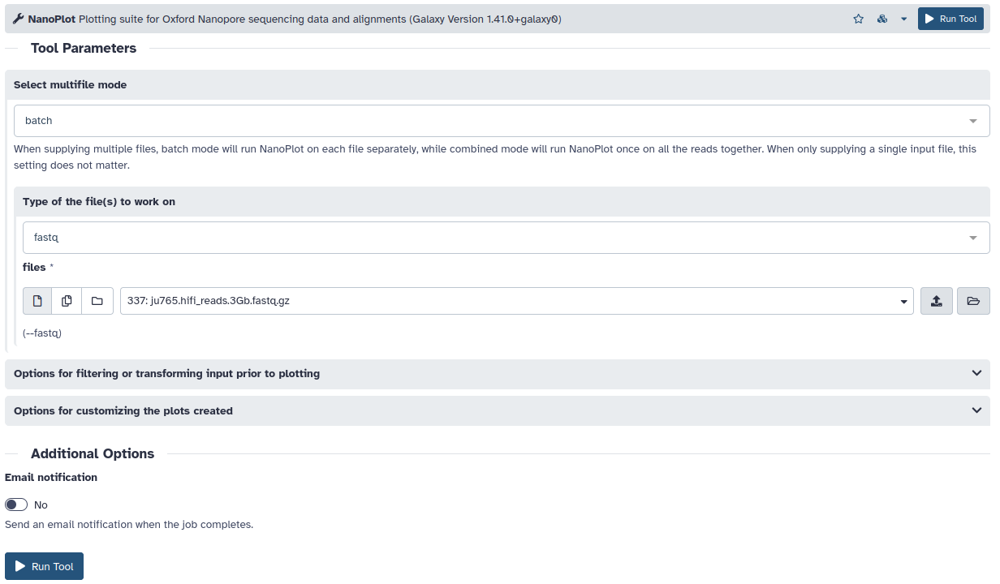

# Analysis of DNA sequencing

[NanoPlot](https://github.com/wdecoster/NanoPlot)



```sh
NanoPlot --tsv_stats --fastq ju765.hifi_reads.3Gb.fastq.gz
```

[jellyfish](https://github.com/gmarcais/Jellyfish)
[GenomeScope2](https://github.com/tbenavi1/genomescope2.0)

```sh
jellyfish count --mer-len 21 ju765.hifi_reads.3Gb.fastq.gz
jellyfish histo -o jellyfish.histo mer_counts.jf
genomescope2 --input jellyfish.histo --output . --kmer_length 21
```
