# *De novo* assembly

Goals:
* generate draft assemblies using PacBio HiFi and Nanopore reads, separately and combined
* investigate the assembly graph

## hifiasm (PacBio HiFi only)

[hifiasm](https://github.com/chhylp123/hifiasm)

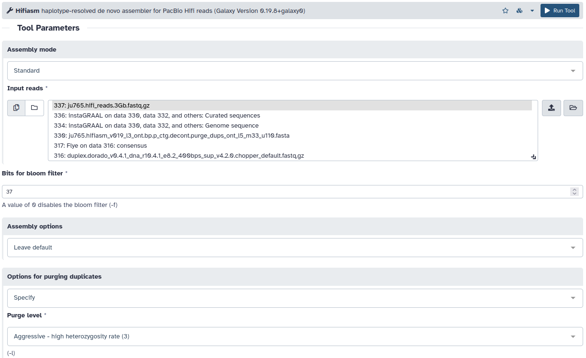

```sh
hifiasm -o output -f 37 -l 3 --primary ju765.hifi_reads.3Gb.fastq.gz
```

## Flye (HiFi)

[Flye](https://github.com/fenderglass/Flye)

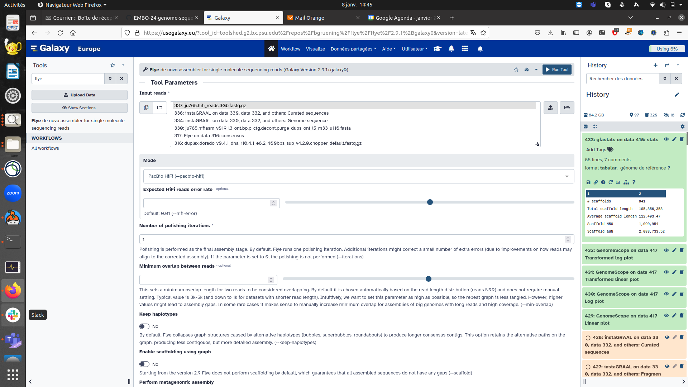

```sh
flye --pacbio-hifi ju765.hifi_reads.3Gb.fastq.gz -o out_dir -i 1
```

## Flye (Nanopore)

[Flye](https://github.com/fenderglass/Flye)

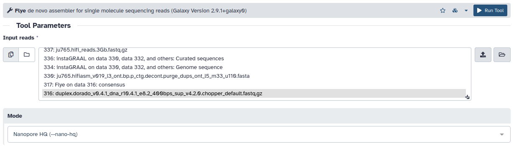

```sh
flye --nano-hq duplex.dorado_v0.4.1_dna_r10.4.1_e8.2_400bps_sup_v4.2.0.chopper_default.fastq.gz -o out_dir -i 1
```

## hifiasm (PacBio HiFi + Nanopore)

[hifiasm](https://github.com/chhylp123/hifiasm)


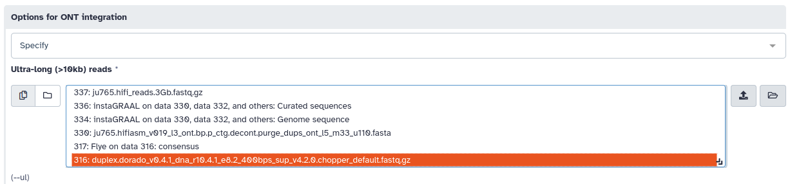

```sh
hifiasm -o output -f 37 -l 3 --ul duplex.dorado_v0.4.1_dna_r10.4.1_e8.2_400bps_sup_v4.2.0.chopper_default.fastq.gz --ul-rate 0.2 --ul-tip 6 --primary ju765.hifi_reads.3Gb.fastq.gz
```

## Converting graphical fragment assembly (GFA) to fasta file

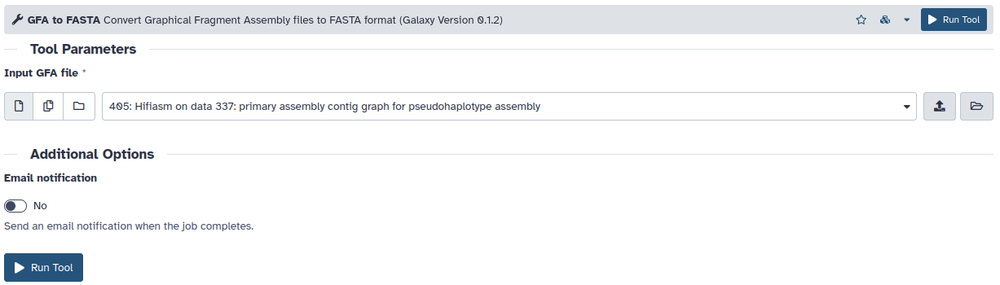

```sh
awk '/^S/{print ">"$2;print $3}' assembly.gfa > assembly.fasta
```

## Checking the graphical fragment assembly (GFA)

[Bandage](https://rrwick.github.io/Bandage/)

### Bandage info

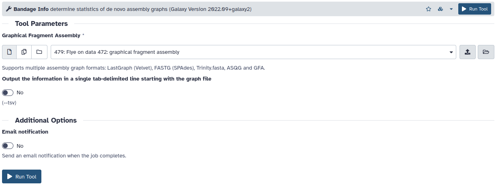

```sh
Bandage info input.gfa 
```

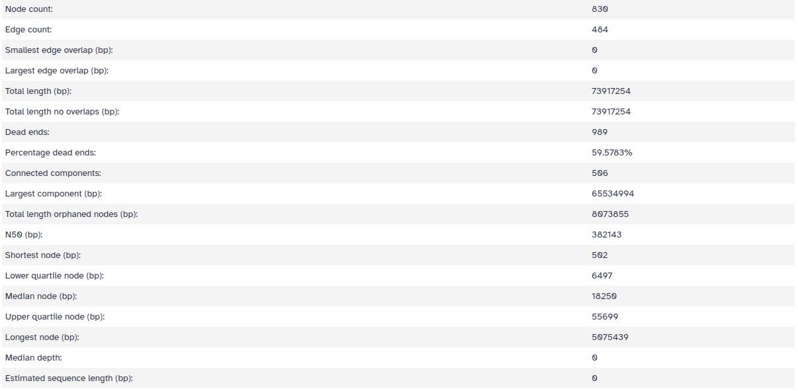

### Bandage image

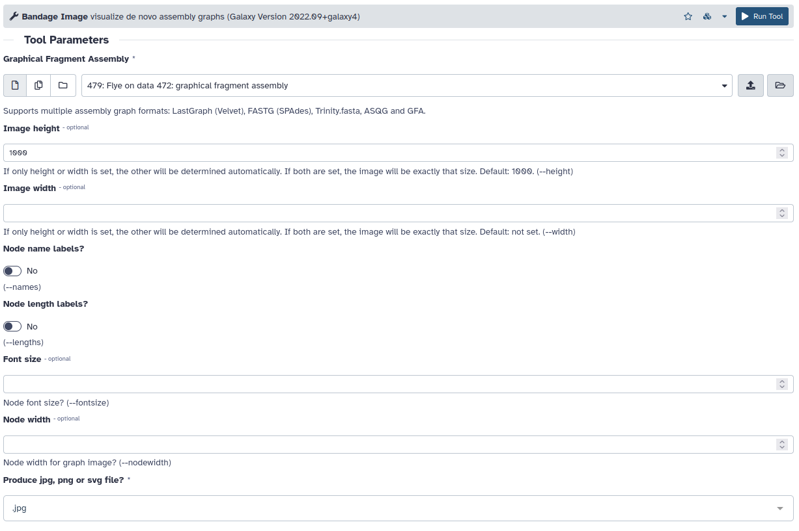

```sh
Bandage image input.gfa 
```

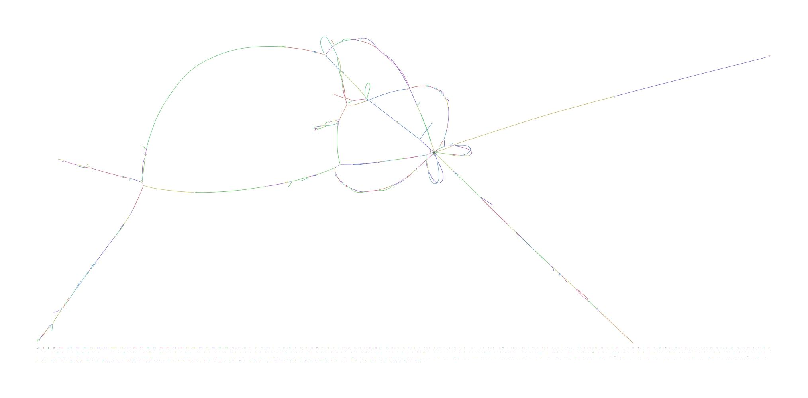

## Bandage image results for the different assemblies
Flye: ONT raw (not decontaminated)
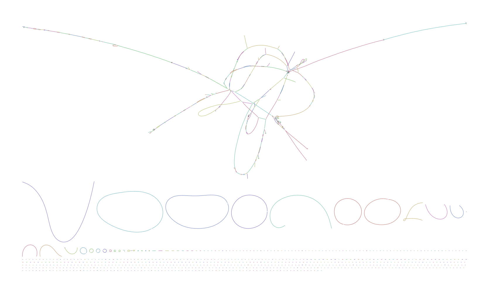
Flye: HiFi raw (not decontaminated)
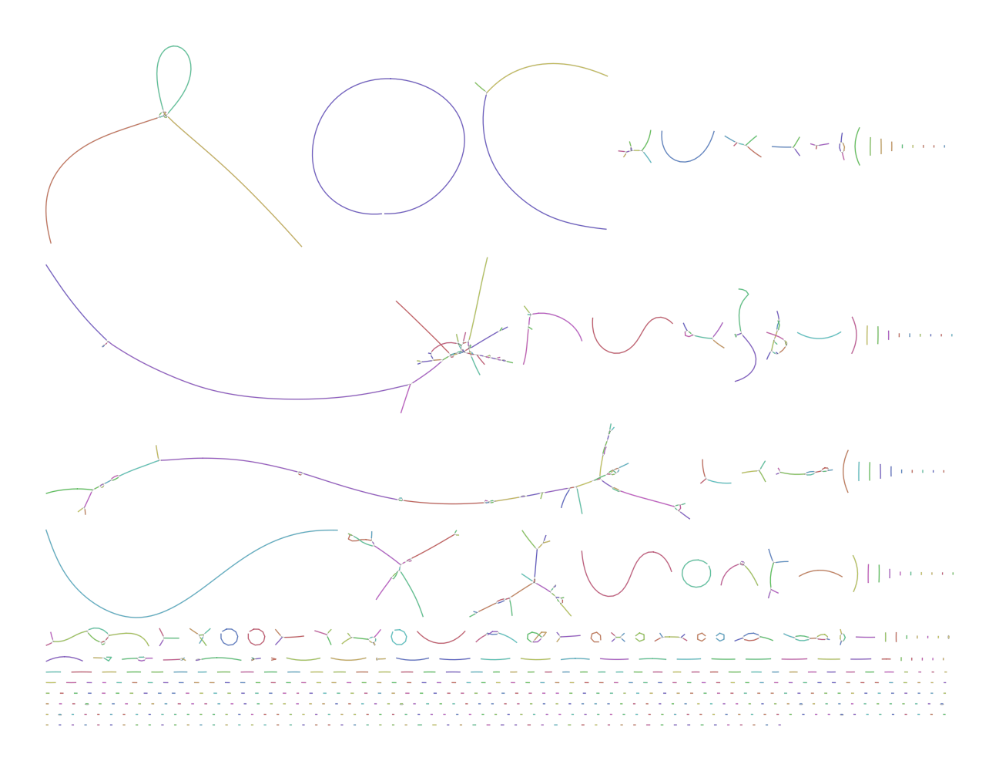
Flye: ONT decontaminated
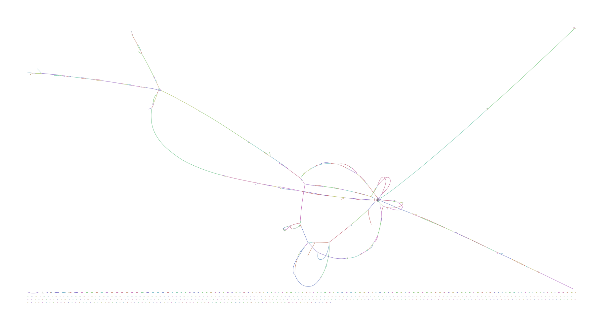
Flye: HiFi decontaminated
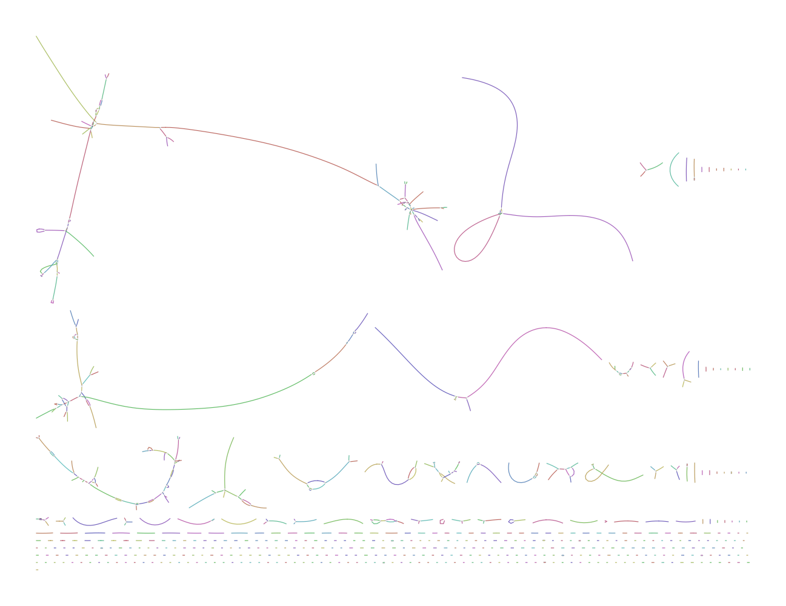
Hifiasm: HiFi decontaminated
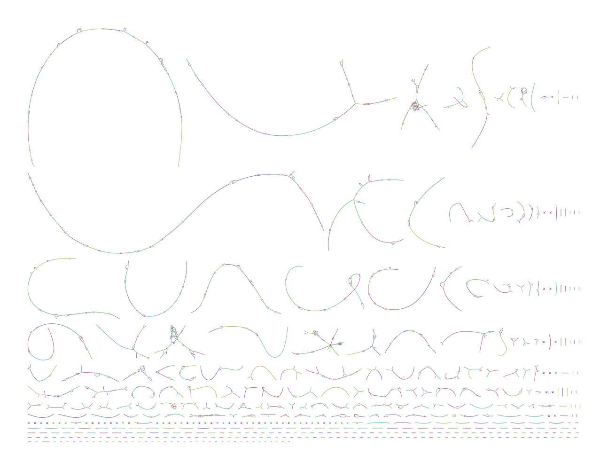
Hifiasm: HiFi decontaminated + ONT decontaminated
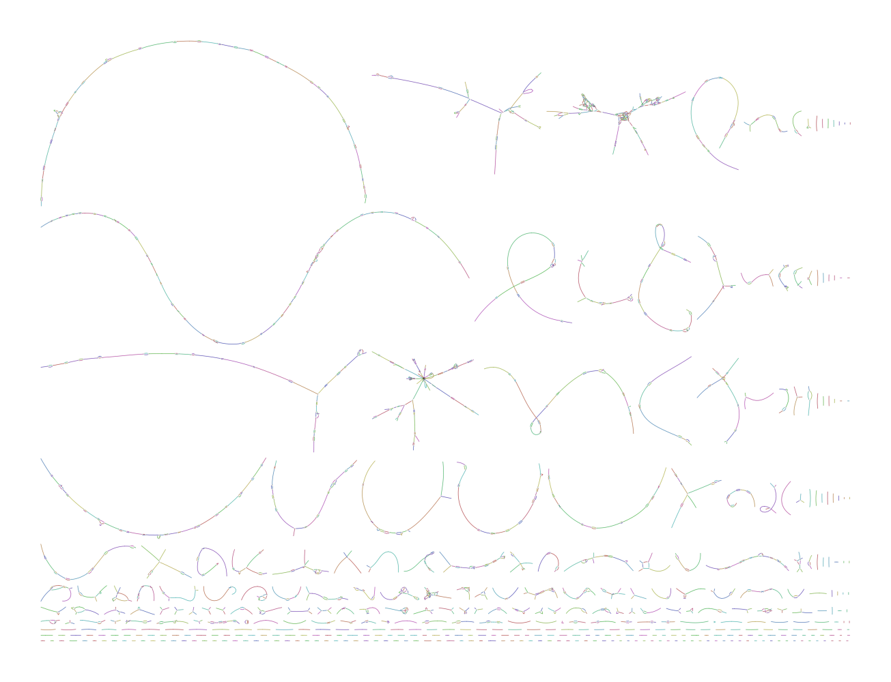

## Assembly comparison

| Reads           | Assembler | Size       | N50     | # contigs |
| --------------- | --------- | ---------- | ------- | --------- |
| HiFi            | hifiasm   | 60,019,763 | 389,632 | 326       |
| HiFi            | Flye      | 83,597,840 | 308,436 | 487       |
| Nanopore        | Flye      | 75,126,661 | 390,041 | 678       |
| HiFi + Nanopore | hifiasm   | 59,651,792 | 480,804 | 225       |
