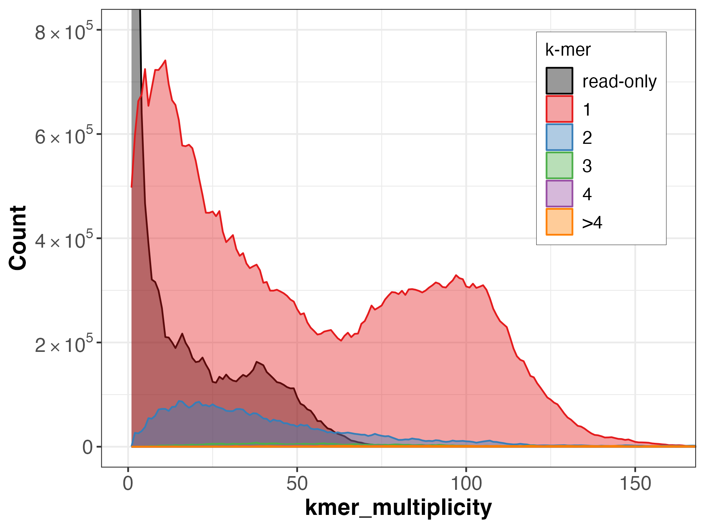
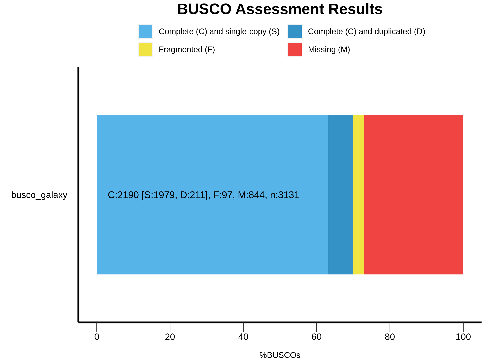

# Assembly evaluation

## Assembly statistics

[gfastats]()


```sh
gfastats assembly.fasta --nstar-report --locale en_US.UTF-8  --tabular 
```

## Ortholog completeness

[BUSCO](https://busco.ezlab.org/)


```sh
busco --in assembly.fasta --mode genome --out busco_out --evalue 0.001 --limit 3 --contig_break 10 --auto-lineage
```

## *k*-mer completeness

[Meryl](https://github.com/marbl/meryl)
[Merqury](https://github.com/marbl/merqury)


# Quality control metrics for the contigs generated from Hifiasm with HiFi+ONT (decontaminated)

## Merqury
Spectra-CN plot (fl) for the primary assembly

**NOTE:** the default Merqury plot rendering is zoomed in, to zoom out you need to download the histogram file and run the [plot_spectra.R](https://github.com/marbl/merqury/blob/master/plot/plot_spectra_cn.R) script.

## BUSCO
Metazoa BUSCO set:

Nematoda BUSCO set:

