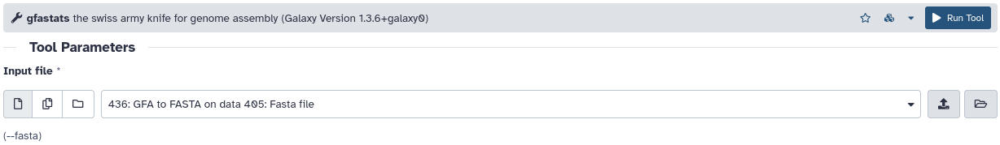
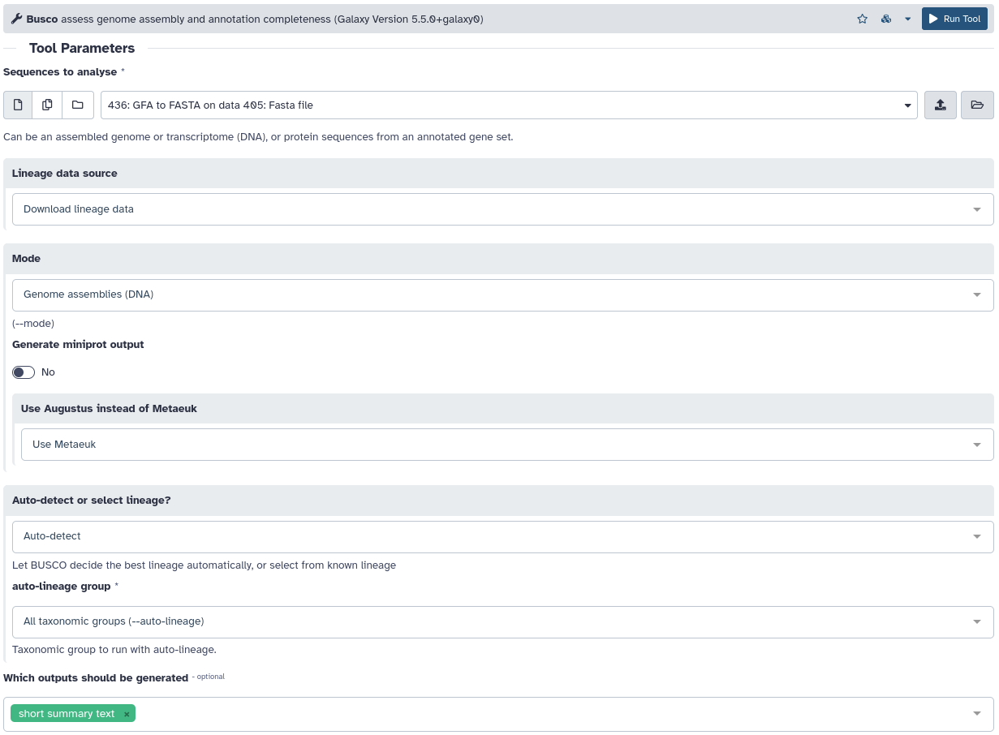
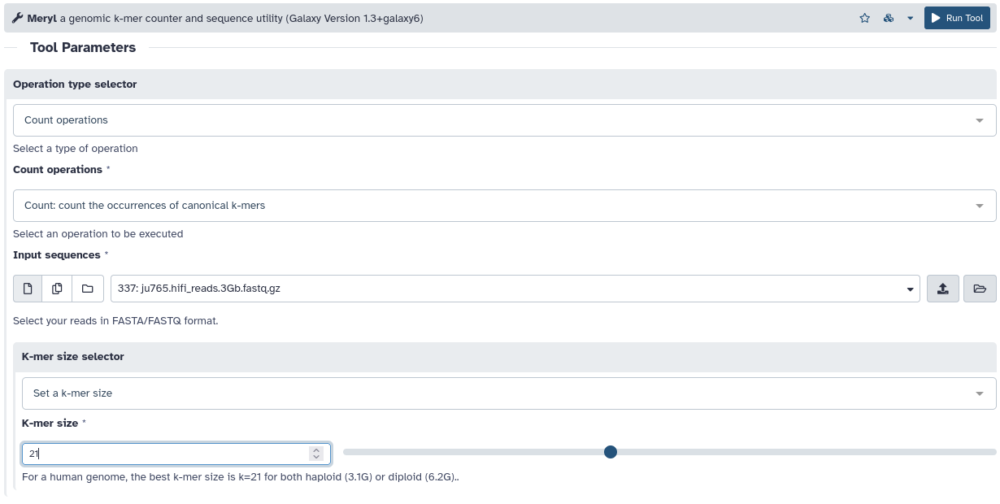
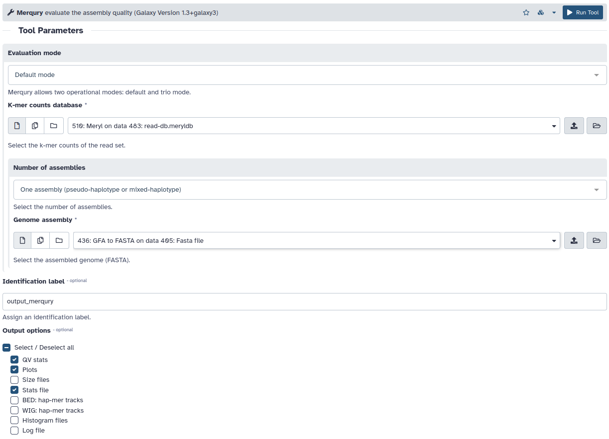

# Assembly evaluation

## Assembly statistics

[gfastats]()



```sh
gfastats assembly.fasta --nstar-report --locale en_US.UTF-8  --tabular 
```

## Ortholog completeness

[BUSCO](https://busco.ezlab.org/)



```sh
busco --in assembly.fasta --mode genome --out busco_out --evalue 0.001 --limit 3 --contig_break 10 --auto-lineage
```

## *k*-mer completeness

[Meryl](https://github.com/marbl/meryl)
[Merqury](https://github.com/marbl/merqury)





