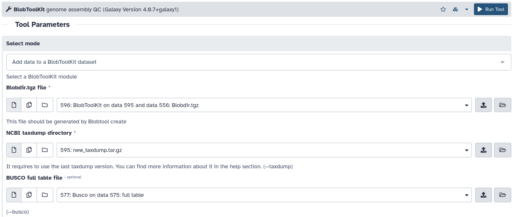

# Decontamination

## Find hits 

[BLAST](https://blast.ncbi.nlm.nih.gov/Blast.cgi)

```sh
blastn -query assembly.fasta -db nt -outfmt "6 qseqid staxids bitscore std sscinames scomnames" -max_hsps 1 -evalue 1e-25 -out blast.out
```

## Find BUSCO orthologs

[BUSCO](https://busco.ezlab.org/)

```sh
busco --in assembly.fasta --mode genome --out busco_out -l metazoa_odb10
```

## Mapping long reads to the assembly

[minimap2](https://github.com/lh3/minimap2)


```sh
minimap2 -ax map-hifi assembly.fasta hifi_reads.fastq.gz | samtools sort -o minimap2_hifi.bam
minimap2 -ax map-ont assembly.fasta ont_reads.fastq.gz | samtools sort -o minimap2_ont.bam
```

## Create Blobtools directory

[Get new_taxdump.tar.gz here](https://ftp.ncbi.nlm.nih.gov/pub/taxonomy/new_taxdump/)

[Blobtools2](https://github.com/blobtoolkit/blobtoolkit)




```sh
blobtools add --fasta assembly.fasta --cov minimap2_hifi.bam --hits blast.out --busco busco_out/run_metazoa_odb10/full_table.tsv --taxdump taxdump --create blobdir
```
