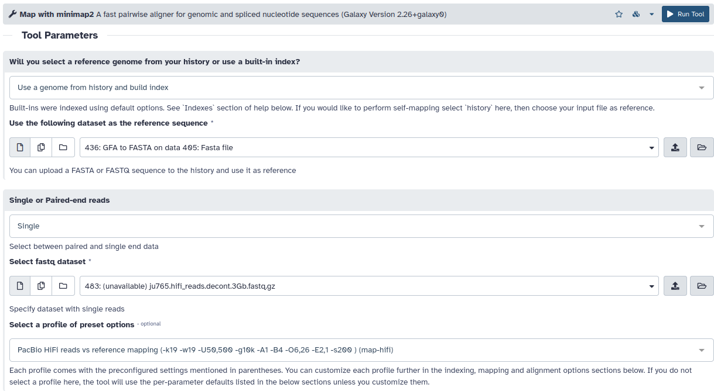
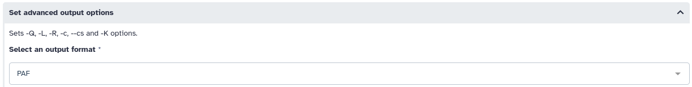
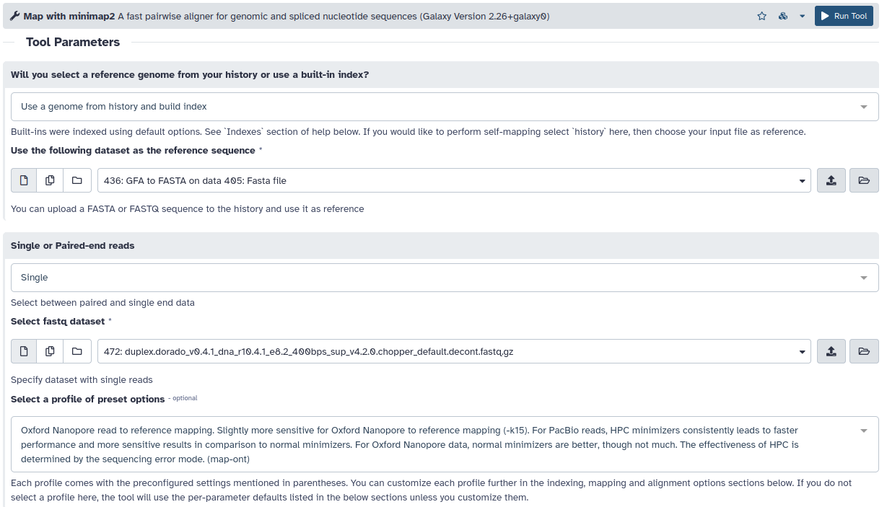
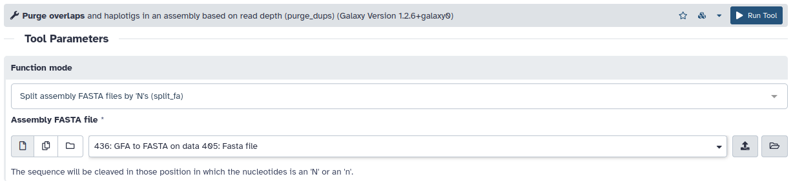
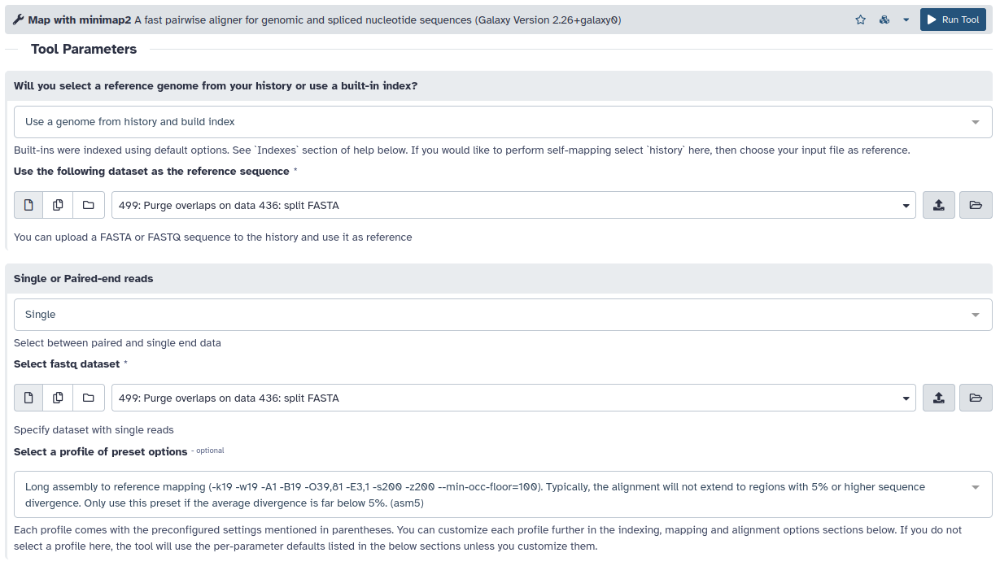
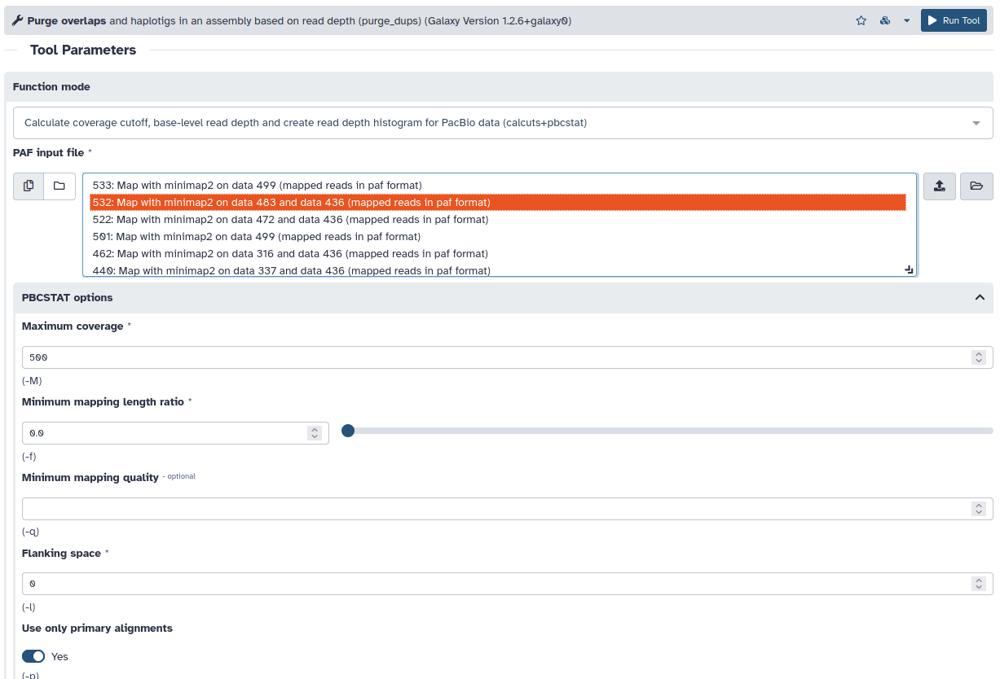
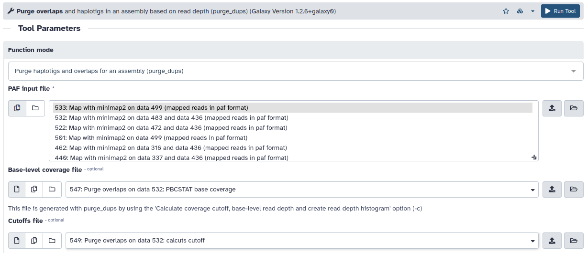
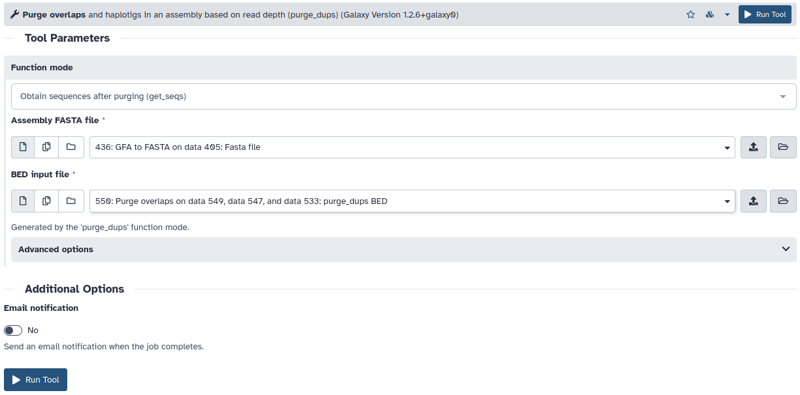
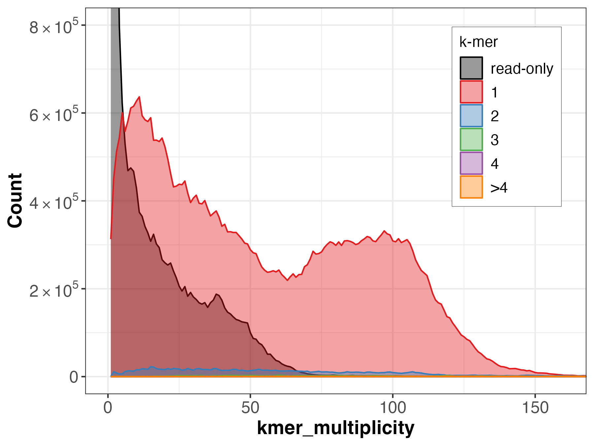
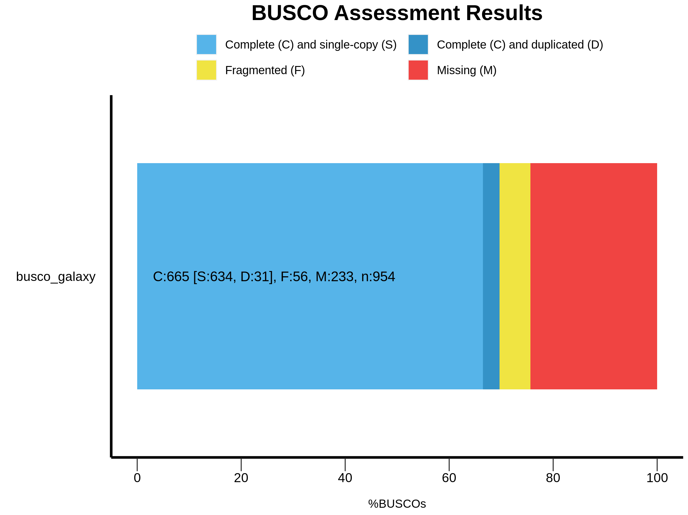

# Haplotig purging

## Mapping reads to the assembly

### PacBio HiFi reads

[minimap2](https://github.com/lh3/minimap2)




```sh
minimap2 -x map-hifi --q-occ-frac 0.01 assembly.fasta hifi.fastq.gz > minimap2_hifi.paf
```

### Nanopore reads

[minimap2](https://github.com/lh3/minimap2)




```sh
minimap2 -x map-ont --q-occ-frac 0.01 assembly.fasta hifi.fastq.gz > minimap2_ont.paf
```

## Splitting and self-mapping the assembly

[purge_dups](https://github.com/dfguan/purge_dups)



```sh
split_fa assembly.fasta > split.fa
```

[minimap2](https://github.com/lh3/minimap2)




```sh
minimap2 -x asm5 --q-occ-frac 0.01 split.fa split.fa > minimap2_self.paf
```

## Calculating cutoffs

[purge_dups](https://github.com/dfguan/purge_dups)



```sh
gzip minimap2_hifi.paf
pbcstat -M 500 -f 0.0 -l 0 -p minimap2_hifi.paf.gz
calcuts -f 0.1 -d 0 PB.stat > cutoffs.tsv 2>calcuts.log 
python purge_dups/hist_plot.py --cutoffs cutoffs.tsv --title 'Read depth histogram plot' PB.stat hist.png
```

## Purging duplications

[purge_dups](https://github.com/dfguan/purge_dups)



```sh
gzip -c minimap2_self.paf
purge_dups -c PB.base.cov -T cutoffs.tsv -f 0.8 -a 70 -b 200 -m 500 -M 20000 -l 10000 -E 15000 minimap2_self.paf.gz > dups.bed 2> purge_dups.log
```

## Getting the purged assembly sequence

[purge_dups](https://github.com/dfguan/purge_dups)



```sh
get_seqs -e -l 10000 -m 0.05 -g 10000 dups.bed assembly.fasta
```

# Quality control metrics for the purged contigs

## Merqury
Spectra-CN plot (fl) for the purged primary assembly 

**NOTE:** the default Merqury plot rendering is zoomed in, to zoom out you need to download the histogram file and run the [plot_spectra.R](https://github.com/marbl/merqury/blob/master/plot/plot_spectra_cn.R) script.

## BUSCO
Metazoa BUSCO set:

Nematoda BUSCO set:

