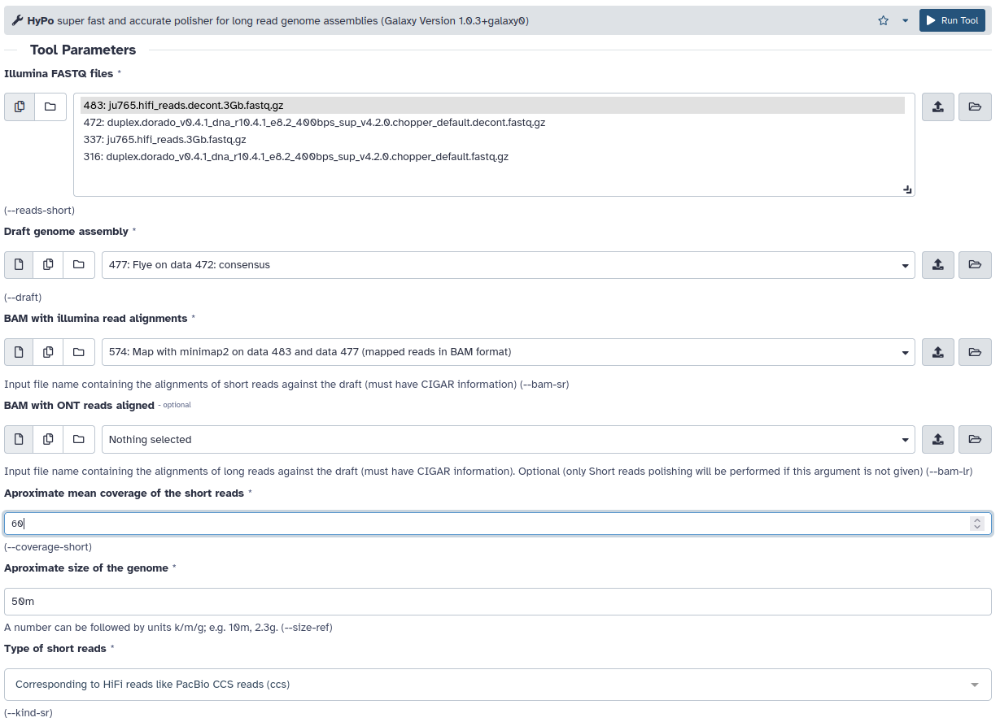

# Polishing

## Mapping the PacBio HiFi reads to the Nanopore assembly

[minimap2](https://github.com/lh3/minimap2)


```sh
minimap2 -ax map-hifi --q-occ-frac 0.01 assembly.fasta hifi.fastq.gz > minimap2_hifi.bam
```

## Polishing the assembly

[HyPo](https://github.com/kensung-lab/hypo)



```sh
echo ju765.hifi_reads.3Gb.fastq.gz >>  short_reads.txt &&
hypo --reads-short @short_reads.txt --draft assembly.fasta --bam-sr minimap2_hifi.bam --coverage-short 60 --size-ref '50m' --kind-sr ccs \
  --match-sr 5 --mismatch-sr -4 --gap-sr -8 --match-lr 3 --mismatch-lr -5 --gap-lr -4 --ned-th 20 --qual-map-th 2 -o polished.fasta
```

BUSCO on Flye Nanopore assembly **before** Hypo HiFi polishing:

	---------------------------------------------------
	|Results from dataset nematoda_odb10               |
	---------------------------------------------------
	|C:69.7%[S:60.2%,D:9.5%],F:3.1%,M:27.2%,n:3131     |
	|2184	Complete BUSCOs (C)                        |
	|1885	Complete and single-copy BUSCOs (S)        |
	|299	Complete and duplicated BUSCOs (D)         |
	|98	Fragmented BUSCOs (F)                      |
	|849	Missing BUSCOs (M)                         |
	|3131	Total BUSCO groups searched                |
	---------------------------------------------------


BUSCO on Flye Nanopore assembly **after** Hypo HiFi polishing:

	---------------------------------------------------
	|Results from dataset nematoda_odb10               |
	---------------------------------------------------
	|C:70.0%[S:60.4%,D:9.6%],F:3.1%,M:26.9%,n:3131     |
	|2192	Complete BUSCOs (C)                        |
	|1891	Complete and single-copy BUSCOs (S)        |
	|301	Complete and duplicated BUSCOs (D)         |
	|97	Fragmented BUSCOs (F)                      |
	|842	Missing BUSCOs (M)                         |
	|3131	Total BUSCO groups searched                |
	--------------------------------------------------- 
