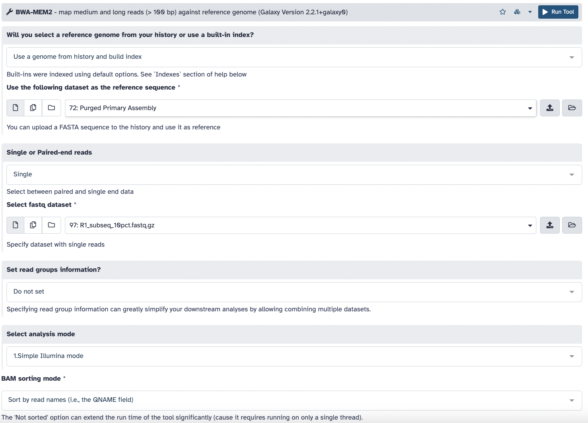
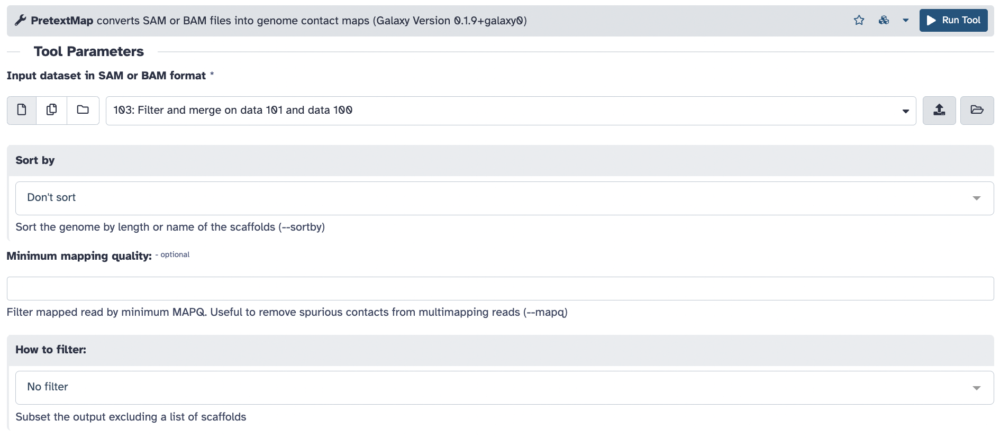
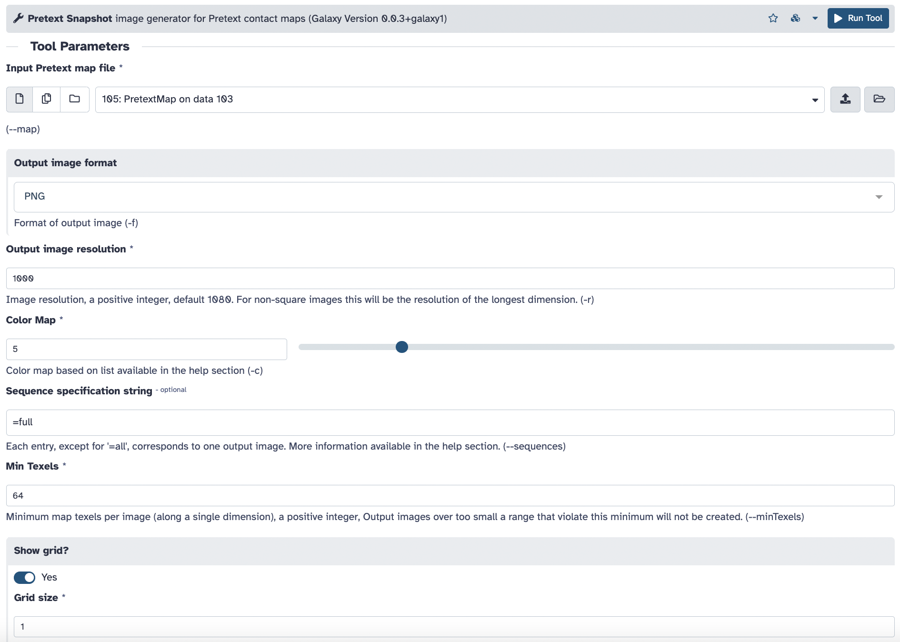
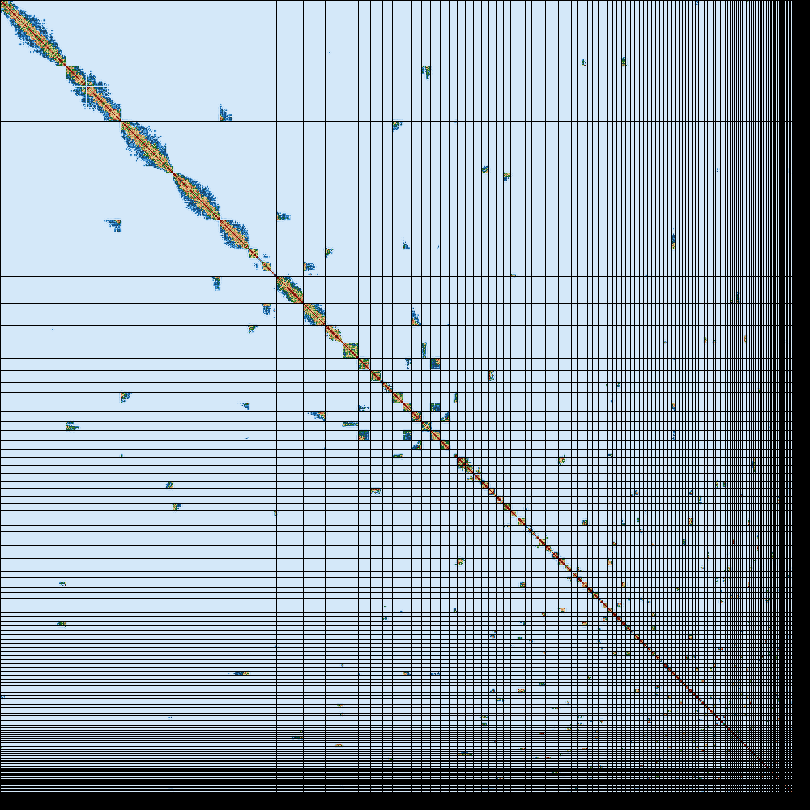
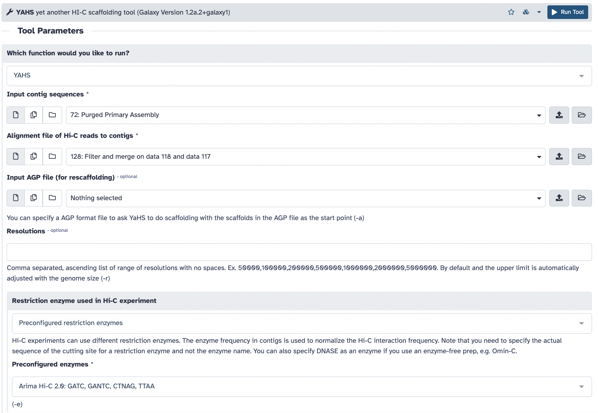
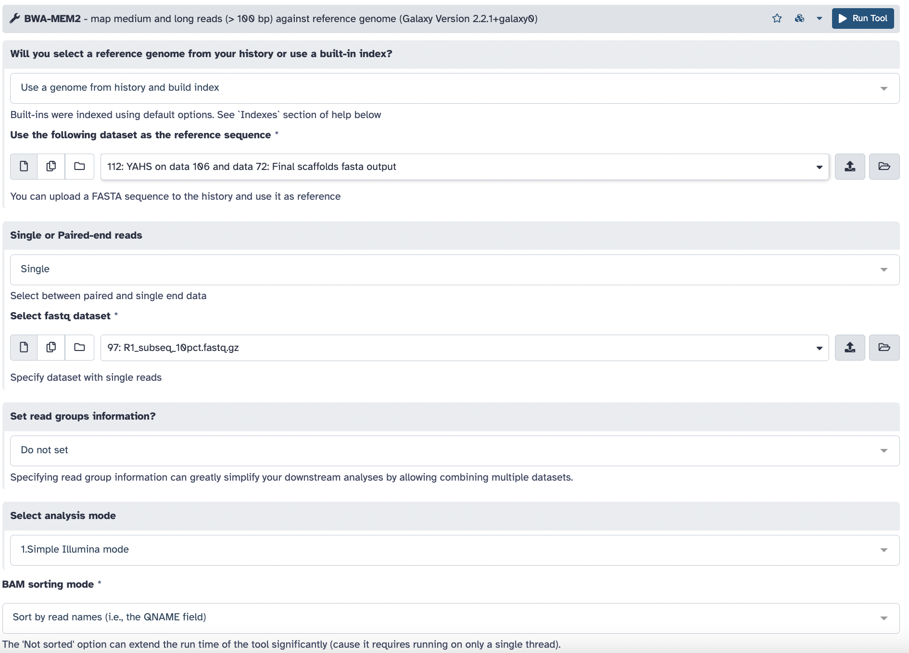
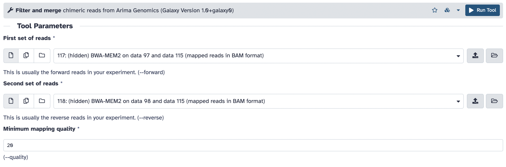
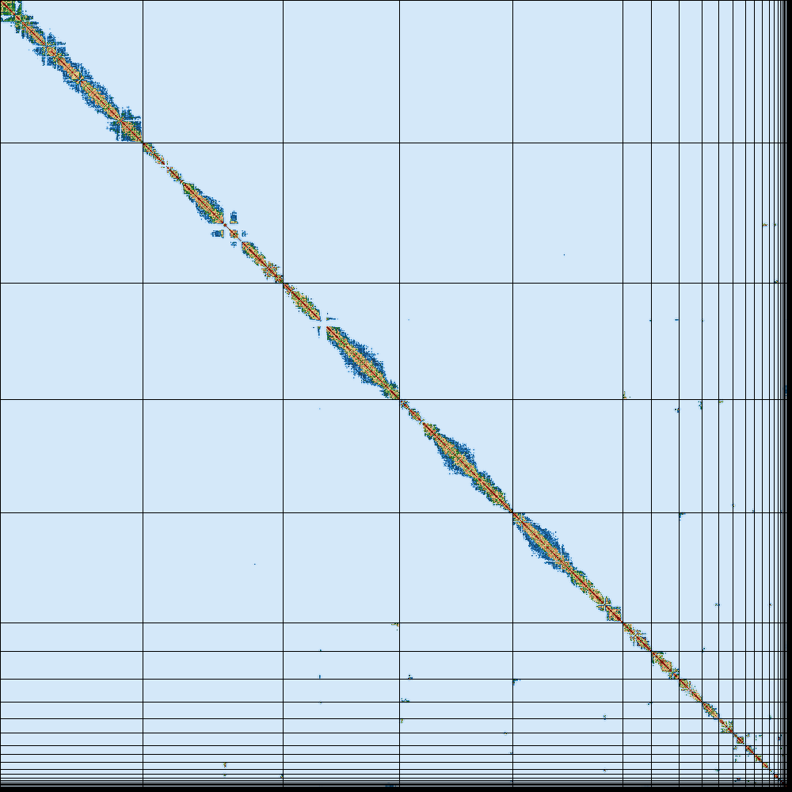

# Hi-C scaffolding

Goals:
* scaffold our contigs using Hi-C data
* evaluate the Hi-C contact maps

## BWA MEM2 (mapping R1 and R2 reads *separately*) on the contigs

[bwa mem2](https://github.com/bwa-mem2/bwa-mem2)



Note that we are treating the paired reads as separate, unpaired files. We need to get a name-sorted BAM (instead of the usual coordinate-sorted ones), because we will need to find pairs later on, and due to the nature of Hi-C sequencing, these pairs should have their R1 and R2 reads at distant coordinates from each other. 

```sh
bwa-mem2 index assembly.fasta
bwa-mem2 mem assembly.fasta R1_subseq_10pct.fastq.gz | samtools sort -n -O bam -o contigs_R1.bam
```

**Repeat this with the R2 data to create a `R2.bam`.**

## Bellerophon (Arima mapping pipeline) on the contigs

[arima mapping pipeline](https://github.com/ArimaGenomics/mapping_pipeline/tree/master) [bellerophon conda wrapper](https://bioconda.github.io/recipes/bellerophon/README.html)


Bellerophon is a conda wrapper for the Arima mapping pipeline. This step finds pairs and filters them to remove pairs with chimeric reads (reads that cover the ligation junction, thus artifically connecting two distant parts of the sequence).

```sh
bellerophon --forward contigs_R1.bam --reverse contigs_R2.bam --quality 20 --output contigs_merged.bam
samtools sort --no-PG -O bam -o contigs_merged_sorted.bam contigs_merged.bam
```

## PretextMap and PretextSnapshot on the contigs

[PretextMap](https://github.com/wtsi-hpag/PretextMap) [PretextSnapshot](https://github.com/wtsi-hpag/PretextSnapshot)



```sh
samtools view -h contigs_merged_sorted.bam | PretextMap -o contigs.pretext
```



```sh
PretextSnapshot -m contigs.pretext -f png -r 1000 -c 5 --sequences '=full' --minTexels 64 --gridSize 1 --gridColour black '' -o output --prefix contigs
```

The result will look like this:


## Yet Another Hi-C Scaffolder (YaHS)

[YaHS](https://github.com/c-zhou/yahs)



```sh
yahs assembly.fasta merged_sorted.bam -e 'GATC,GANTC,CTNAG,TTAA' -o yahs_out
# this following step just symlinks the scaffolds with a different name
ln -s yahs_out_scaffolds_final.fa scaffolds.fasta
```

## BWA MEM2 (mapping R1 and R2 reads *separately*) on the scaffolds



To obtain the Hi-C contact map for our scaffolded assembly to assess the impact of scaffolding, we need to map the Hi-C reads to the scaffolded assembly. **Don't forget to do this for R2 as well.**

```sh
bwa-mem2 index scaffolds.fasta
bwa-mem2 mem scaffolds.fasta R1_subseq_10pct.fastq.gz | samtools sort -n -O bam -o scaffolds_R1.bam
```

## Bellerophon (Arima mapping pipeline) on the scaffolds



Bellerophon is a conda wrapper for the Arima mapping pipeline. This step finds pairs and filters them to remove pairs with chimeric reads (reads that cover the ligation junction, thus artifically connecting two distant parts of the sequence).

```sh
bellerophon --forward scaffolds_R1.bam --reverse scaffolds_R2.bam --quality 20 --output scaffolds_merged.bam
samtools sort --no-PG -O bam -o scaffolds_merged_sorted.bam scaffolds_merged.bam
```

## PretextMap and PretextSnapshot on the scaffolds

**The Galaxy tool run will be the same parameters as the above, just make sure you select the bellerophon output corresponding to your scaffolds.**

```sh
samtools view -h scaffolds_merged_sorted.bam | PretextMap -o scaffolds.pretext
PretextSnapshot -m scaffolds.pretext -f png -r 1000 -c 5 --sequences '=full' --minTexels 64 --gridSize 1 --gridColour black '' -o output --prefix scaffolds
```

The result will look like this:

