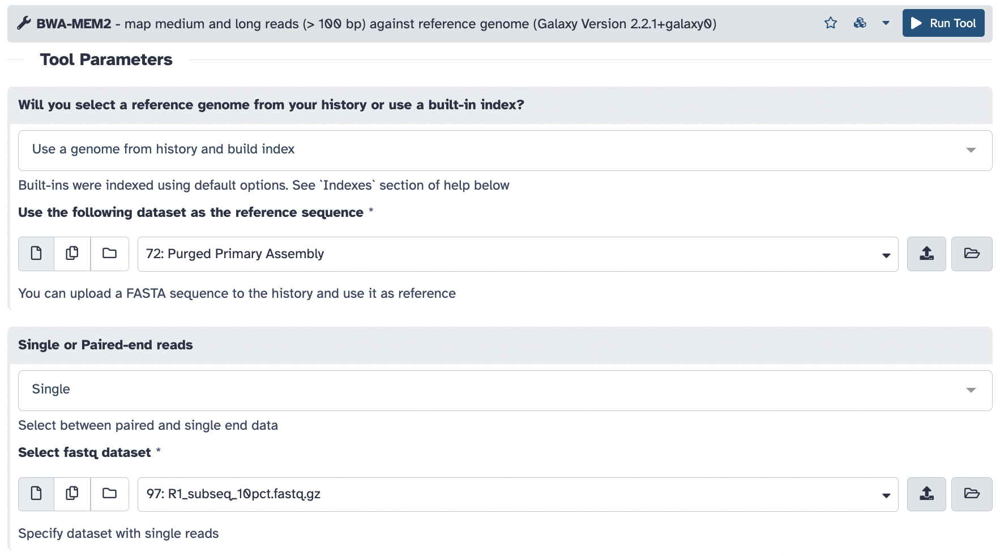

# Hi-C scaffolding

Goals:
* scaffold our contigs using Hi-C data
* evaluate the Hi-C contact maps

## BWA MEM2 (mapping R1 and R2 reads *separately*)

[bwa mem2](https://github.com/bwa-mem2/bwa-mem2)



Note that we are treating the paired reads as separate, unpaired files.

```sh
bwa-mem2 index assembly.fasta
bwa-mem2 mem assembly.fasta R1_subseq_10pct.fastq.gz | samtools sort -n -O bam -o R1.bam
```

Repeat this with the R2 data to create a `R2.bam`.

